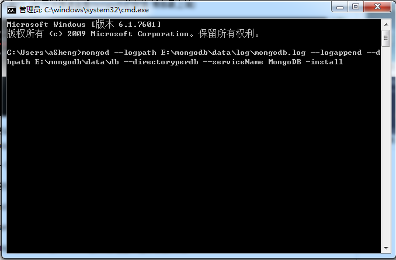

# practice
用于平时的学习笔记
#### 数组的操作方法
**slice(对原数组的副本进行编辑，原数组不影响)**
```
 var arr = ['h','e','l','l','o'];

 var arr1 = arr.slice(1,2);//  arr1 = ['e'] (第一个参数是从哪开始，第二个参数是从哪结束，但是不包含该索引)

```

**splice(同时改变原数组)**

```

//返回的是删除的项，如果删除项为空，则返回空数组
var arr = ['h','e','l','l','o'];
*删除*
var arr1 = arr.splice(2,2);//  arr1 = ['l','l']  (第一个参数为从哪开始截取，第二个参数为截取的项数);
*插入*
var arr2 = arr.splice(2,0,'wor','ld');// arr2 = [](arr2并没有改变)，arr = ["h", "e", "wor", "ld", "l", "l", "o"]改变的是arr
*替换*
var arr3 = arr.splice(2,1,'wor'.'ld');// arr3 = ['e'], arr = ['h','wor','ld','l','l','o'] 原理是先删除后加入
```

#### 数组的位置放法

**indexOf()**和**lastIndexOf()**
```
var number = [1,2,3,4,5,4,3,2,1];

var number1 = number.indexOf(4);// 3 (返回第一个‘4’的位置);

var number2 = number.indexOf(3,4); // 6 (返回第二个‘3’的位置，因为第二个参数‘4’指定了从索引‘4’开始数);

var number3 = number.lastIndexOf(4);// 5 (从末尾开始数,返回遇到第一个符合项的索引)

var number4 = number.lastIndexOf(3,4); // 2

```


#### 原生AJAX的封装

```
function ajax(options){
	options = options || {};
	options.type = (options.type || "GET").toUpperCase();//如果小写转成大写
	options.dataType = options.dataType || "json";
	var params = params(option.data);
	if(window.XMLHttpRequest){
		var xhr = new XMLHttpRequest();//非IE6
	}else{
		var xhr = new ActiveXObject('Microsoft.XMLHttp');// IE6
	}
//接收
	xhr.onreadystatechange = function(){
		if(xhr.readyState == 4){
			var status = xhr.status;
			if(status >= 200 && status < 300){
				options.success && options.success(xhr.responseText,xhr.responseXML);
			}else{
				options.fail && options.fail(status); 
			}
		}
	}

	//连接和发送

	if(options.type == "GET") {
		xhr.open("GET",options.url+"?"+ params,true);
		xhr.send(null);
	}else if(options.type == "POST") {
		xhr.open("POST",options.url,true);
		xhr.setRequestHeader("Content-Type","application/x-www-form-urlencode");
		xhr.send(params);
	}
}
//处理参数
function params(data){
	var arr = [];
	for(var name in data){
		arr.push(encodeURIComponent(name) + "=" + encodeURIComponent(data[name]));
	}
	return arr.join("&");
}	


```

#### windows上安装mongodb服务

;

```
mongod --logpath E:\mongodb\data\log\mongodb.log --logappend --dbpath E:\mongodb\data\db --directoryperdb --serviceName MongoDB -install

//设置开启windows服务
```

```
net start MongoDB
//启动服务
```

```
net stop MongoDB
//关闭服务
```

#### Get和POST的区别

##### GET请求：


- 查询字符串（名称/值对）是在GET请求的URL中发送的;
- GET请求可被缓存
- 可被收藏为书签
- 被保存在历史记录中
- 有长度限制
- 只应当用于取回数据


##### POST请求


- 查询字符串（名称/值对）是在请求的http消息主体中发送的
- 请求不会被缓存
- 请求不会保存在浏览器历史记录中
- 因为不是在URL中，所以不能被收藏为书签
- 没有长度限制


##### 具体比较图表
;